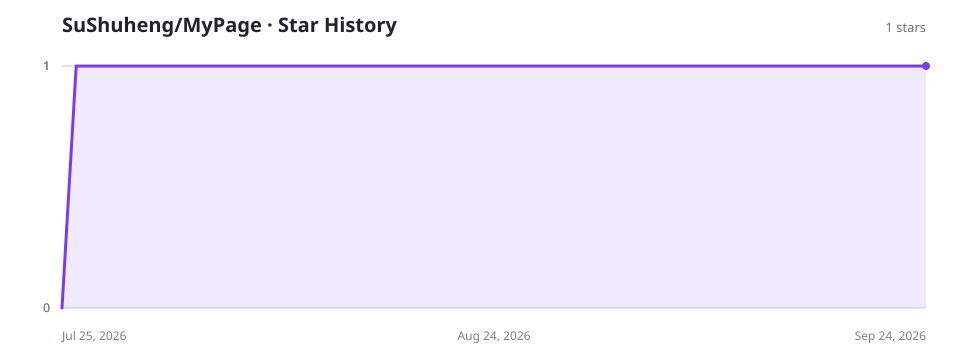

# MyPage

<p align="center">
  
</p>

<p align="center">
  面向 Obsidian 的高度可定制、可交互可视化主页与 DIY 模块平台。
</p>

<p align="center">
  <a href="https://github.com/SuShuHeng/MyPage/releases/latest"></a>
  <a href="https://github.com/SuShuHeng/MyPage/actions/workflows/ci.yml"></a>
  <a href="LICENSE"></a>
  
</p>

MyPage 将多主页 TAB、响应式组件网格、主题系统、数据流水线和模块市场整合为一个本地优先的 Obsidian 主页。它不是固定用途的博客面板：每个组件都可以选择数据范围，用户也可以安装或开发自包含模块，组合出写作、任务、日历、知识库、博客生命周期等不同工作台。

## 安装

### 使用 BRAT（推荐）

1. 在 Obsidian 的“第三方插件市场”中安装并启用 **BRAT**。
2. 打开 `设置 → BRAT → Add Beta Plugin`。
3. 输入仓库地址 `https://github.com/SuShuHeng/MyPage`。
4. 选择最新版本并完成安装，然后在“第三方插件”中启用 **MyPage**。

BRAT 会从 GitHub Release 获取 `manifest.json`、`main.js` 和 `styles.css`，并可继续检查后续更新。

### 手动安装

从 [最新 Release](https://github.com/SuShuHeng/MyPage/releases/latest) 下载 `main.js`、`manifest.json` 和 `styles.css`，放入：

```text
<Vault>/.obsidian/plugins/mypage/
```

重新加载 Obsidian 后，在“第三方插件”中启用 MyPage。最低支持 Obsidian 1.11.4，桌面端优先并兼容移动端。

## 主要功能

- **多主页与编辑会话**：命名 TAB、排序、默认启动页，以及完成/取消式安全编辑。
- **响应式组件网格**：拖拽、缩放、吸附、让位、补位、分组容器和移动端布局。
- **丰富的可视化组件**：指标卡、贡献热力图、趋势图、分布图、笔记集合、TODO、日历目标、Markdown 与快捷操作。
- **统一数据流水线**：按组件限定 Vault 文件夹，支持 Obsidian Bases 适配与可配置数据绑定。
- **三级主题系统**：Obsidian 基础主题、MyPage 主页主题和组件级覆盖。
- **DIY 模块平台**：官方市场、第三方市场、ZIP 导入、GitHub 仓库索引和一个模块多种贡献。
- **双层信任与受控写入**：来源可信不等于自动授权；能力与作用域需要细粒度确认。
- **应用内更新**：稳定版默认、预览版可选，支持启动检测与手动检查。

## 模块与主题市场

官方模块位于 `diy-plugins/`，市场索引位于 `.mypage-market/`；官方主页主题位于 `.mypage-theme-market/`。Release 同时提供独立模块 ZIP、市场索引和完整平台包。`hexo-insights` 只是自由度验证模块，Hexo 业务并未写入 MyPage 内核。

模块开发、权限与市场协议请参阅：

- [模块开发指南](docs/module-development.md)
- [市场协议](docs/marketplace-spec.md)
- [权限模型](docs/permissions.md)
- [安全设计](docs/security.md)

## Star 趋势



该图由仓库的定时 GitHub Actions 使用仓库权限生成，不在 README 中暴露访问令牌。

## 本地开发

```powershell
npm ci
npm run lint
npm run test:all
npm run build
npm run validate:modules
npm run validate:market
npm run validate:theme-market
```

开发版本只能部署到专用 `H:\GitHub\TestDev` Vault，禁止覆盖真实笔记仓库。更多信息见 [Repository Guidelines](AGENTS.md) 和 [发布流程](docs/release.md)。

## License

[Apache License 2.0](LICENSE) © 苏书蘅（SuShuHeng）
